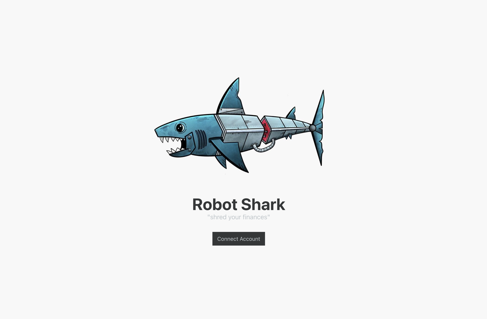
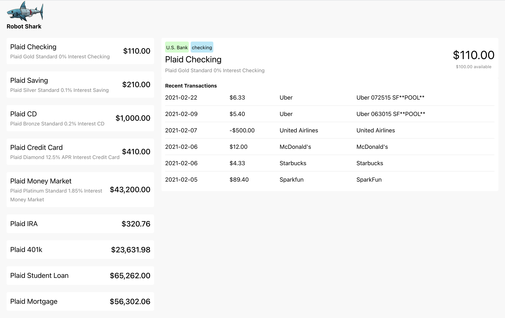

# Robot Shark
##### "shred your finances"
A simple fake site that lets you log into a sandbox plaid account view account information :man_shrugging:





## API
Simple, almost a pure proxy to plaid. There really is no logic being done (which is a listed room for improvement).

#### setup
```
yarn
```
then copy the `.env.example` file to `.env` and replace the plaid client id and secret with any free sandbox account credentials.

#### run
```
yarn start
```

#### test
```
yarn test
```

#### Room for Improvement
- The front end is making three calls to get accounts, transactions, and institution data all to show on the dashboard. Possibly barring a data size issue these calls should probably be modified to be one-per-view so the front end only has to make a single call and the work to combine the data can be pushed back onto the API.
- For sake of simplicty the `access_token` is being stored in process memory. Obviously thats trash. Need to move it to frontend app/browser state and require it as auth for every API call.

## APP
Again, simple, two pages. Click the `Connect Account` button, put in the sandbox creds `user_good` and `pass_good` and then view your accounts.

#### setup
```
yarn
```

#### run
```
yarn start
```

#### test
```
yarn test
```

#### Room for Improvement
- Improve error handling (UX) when API returns errors
- Improve UX in dashboard to show user which account is currently selected
- Store the `access_token` in state and send to API in each request
- More testing. I did smoke tests...
